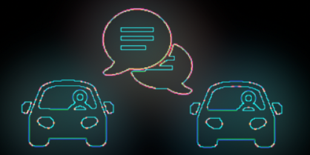

<!-- PROJECT LOGO -->
<br />
<p align="center">
  <a href="https://github.com/othneildrew/Best-README-Template">
    
  </a>

  <h3 align="center">Driver2Driver Communication</h3>

  <p align="center">
    Communication amongst car drivers has remained limited, anonymous and one-sided over the past 130 years🙄😤. We will build a working prototype that allows drivers to           communicate with each other on the road.
    <br />
  </p>
</p>


<!-- TABLE OF CONTENTS -->
<details open="open">
  <summary>Table of Contents</summary>
  <ol>
    <li>
      <a href="#about-the-project">About The Project</a>
      <ul>
        <li><a href="#built-with">Built With</a></li>
      </ul>
    </li>
    <li>
      <a href="#getting-started">Getting Started</a>
      <ul>
        <li><a href="#prerequisites">Prerequisites</a></li>
        <li><a href="#installation">Installation</a></li>
      </ul>
    </li>
    <li><a href="#usage">Usage</a></li>
    <li><a href="#roadmap">Roadmap</a></li>
    <li><a href="#contributing">Contributing</a></li>
    <li><a href="#license">License</a></li>
    <li><a href="#contact">Contact</a></li>
    <li><a href="#acknowledgements">Acknowledgements</a></li>
  </ol>
</details>


<!-- ABOUT THE PROJECT -->
## About The Project

Problem

Flashing lights, rude hand gestures or honking the horn...🙄😤 Communication amongst car drivers has remained limited, anonymous and one-sided over the past 130 years. Research has found that, when sitting in cars, drivers see other motorists as machines rather than social actors. Additionally our identity gets reduced down to the brand of the vehicle.

When you combine all of these factors, you have a really potent recipe for aggressive and anti-social driving behavior (Baumeister & Leary, 1995; Ratan & Tsai, 2014).


Solution

Thankfully, most car drivers want to communicate social cues and add nuance to their communication like "ope, sorry bud" or "get out of the fast lane please". Within the framework of a study, a car-driver admitted that instead of honking the horn and getting angry, he would have shown more tolerance if it had been possible to nuance his protest (Wang, 2019; Sung, 2019).

### Built With

This section should list any major frameworks that you built your project using. Leave any add-ons/plugins for the acknowledgements section. Here are a few examples.
* [ReactNative](https://reactnative.dev/)


<!-- GETTING STARTED -->
## Getting Started

This is about how to download, install and start the project
To get a local copy up and running follow these simple steps.

### Prerequisites

This is an example of how to list things you need to use the software and how to install them.
* npm
  ```sh
  npm install npm@latest -g
  ```

### Installation

1. Clone the repo
   ```sh
   git clone https://github.com/your_username_/Project-Name.git
   ```
2. Install NPM packages
   ```sh
   npm install
   ```
3. Login Expo
   ```sh
   expo login
   ```  
4. Start the app with Expo
   ```sh
   expo start
   ```   


<!-- USAGE EXAMPLES -->
## Usage

Use this space to show useful examples of how a project can be used. Additional screenshots, code examples and demos work well in this space. You may also link to more resources.

_For more examples, please refer to the [Documentation](https://example.com)_


<!-- ROADMAP -->
## Roadmap

See the [open issues](https://github.com/othneildrew/Best-README-Template/issues) for a list of proposed features (and known issues).


<!-- CONTRIBUTING -->
## Contributing

Contributions are what make the open source community such an amazing place to be learn, inspire, and create. Any contributions you make are **greatly appreciated**.

1. Fork the Project
2. Create your Feature Branch (`git checkout -b feature/AmazingFeature`)
3. Commit your Changes (`git commit -m 'Add some AmazingFeature'`)
4. Push to the Branch (`git push origin feature/AmazingFeature`)
5. Open a Pull Request


<!-- LICENSE -->
## License

no current license.


<!-- CONTACT -->
## Contact

Stefanie Keichel - stefanie.keichel@code.berlin

Niklas Jacobsen - niklas.jacobsen@code.berlin

Marius Ratzka - marius.ratzka@code.berlin

Project Link: https://github.com/mratzka/Driver2DriverCommunication/


<!-- ACKNOWLEDGEMENTS -->
## Acknowledgements

* [Miro](https://miro.com/app/board/o9J_l6V2fuc=/)


* [Img Shields](https://shields.io)
* [Choose an Open Source License](https://choosealicense.com)
* [GitHub Pages](https://pages.github.com)
* [Animate.css](https://daneden.github.io/animate.css)
* [Loaders.css](https://connoratherton.com/loaders)
* [Slick Carousel](https://kenwheeler.github.io/slick)
* [Smooth Scroll](https://github.com/cferdinandi/smooth-scroll)
* [Sticky Kit](http://leafo.net/sticky-kit)
* [JVectorMap](http://jvectormap.com)
* [Font Awesome](https://fontawesome.com)


<!-- MARKDOWN LINKS & IMAGES -->
<!-- https://www.markdownguide.org/basic-syntax/#reference-style-links -->
